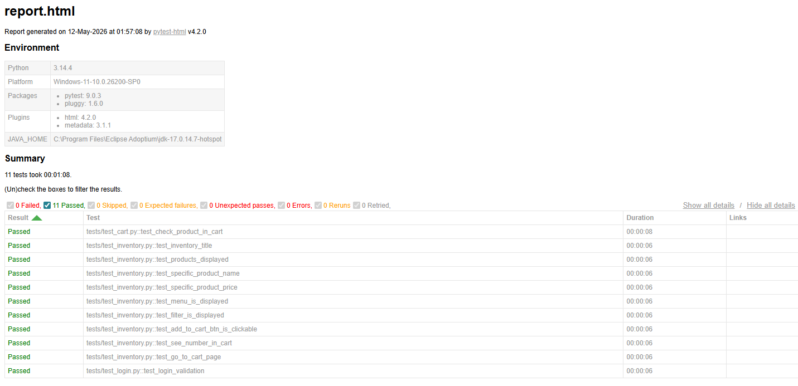

# Proyecto de automatizacion QA - SauceDemo
Por Belen Zelaya

## 📝Descripcion
Este proyecto consiste en la automatización de pruebas funcionales para la aplicación web [SauceDemo](https://www.saucedemo.com/). Se enfoca en validar el flujo principal de compra, desde el login hasta la gestión de productos en el carrito, aplicando el patrón de diseño **Page Object Model (POM)**.

## 🛠️Tecnologias usadas
-**Lenguaje:** Python 3.x
-**Automatizacion:** Selenium WebDriver
-**Framework de testing:** Pytest
-**Reportes:** Pytest-HTML
-**Gestion de drivers:** Webdriver-Manager

## Instalacion
1. Clonar el repositorio:
```bash
git clone https://github.com/beltamz/pre-entrega-automation-testing--belen-zelaya-
```

2. Acceder a la carpeta del proyecto:
```bash
cd pre-entrega-automation-testing--belen-zelaya-/pre-entrega
```

3. Instalar las dependencias:
```bash
pip install selenium webdriver-manager pytest pytest-html
```

## 🧪Ejecución de las Pruebas

Para correr todos los tests y generar el reporte HTML:
```bash
pytest
```

## Funcionamiento de las pruebas
Las pruebas simulan la navegación de un usuario real en la tienda. Se organizan de la siguiente manera:

- ***Flujo de Prueba:*** Cada test prepara el escenario (ej. estar logueado), realiza una acción (clic o navegación) y verifica el resultado mediante mensajes de error personalizados.

- ***Sincronización:*** Se utilizan esperas inteligentes para que el código aguarde a que los elementos aparezcan (como el menú o el número del carrito) antes de interactuar con ellos, evitando fallos por lentitud de la página.

- ***Robustez:*** Si un test falla, el sistema lo informa con un mensaje claro, pero no detiene la ejecución; continúa probando el resto de las funciones automáticamente.

- ***Identificación:*** Se utilizan etiquetas internas (IDs y Selectores) para encontrar los botones y textos, asegurando que las pruebas sigan funcionando aunque cambie levemente el diseño visual.

## Captura informe 'report.html'

